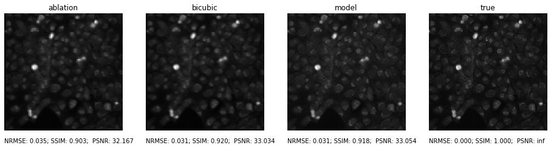

# Enhancement of the elemental imaging

**Elemental imaging** is visualization of the distribution of elements of interest within solid samples. It is widely used across different fields analyzing various materials by many analytical techniques. With destructive methods, such as LA-ICP-MS or LIBS, where the sample is ablated by laser beam spot, by spot, we get pixelated image where the resolution is dependant on the beam size. Decreasing the beam size infinitely is not possible, which leads us to image enhancement by computers.

## Training set preparation
The training set consists of original high resolution images and their 'crappyfied' version created by virtual ablation. **Laser Ablation** is the process of removing material from a solid sample by irradiating it with a laser beam. The quality of the resulting image is highly dependant on the contidions used for ablation.    

Modelling was performed using five consecutive matrix manipulation steps[[1]](https://pubs.rsc.org/en/content/articlehtml/2019/ja/c9ja00166b):
1. laser sampling of the sample in the ablation cell
2. introduction of Flicker noise (mostly associated with pulse reproducibility)
3. aerosol washout from the ablation cell and transfer to the detector
4. measurement by integrating the counts for a chosen dwell time
5. introduction of Poisson noise (as a result of counting statistics)

**LA conditions**

Parameter | Value
--- | --- 
Beam size | 5 μm
Repetition rate | 100 Hz

## Model
*TODO: describe model architecture and loss and training

## Results

**Example images from cell dataset**

## References

[[1]](https://pubs.rsc.org/en/content/articlehtml/2019/ja/c9ja00166b) van Elteren, J.T., Šelih, V.S. and Šala, M., 2019. Insights into the selection of 2D LA-ICP-MS (multi) elemental mapping conditions. Journal of Analytical Atomic Spectrometry, 34(9), pp.1919-1931.
