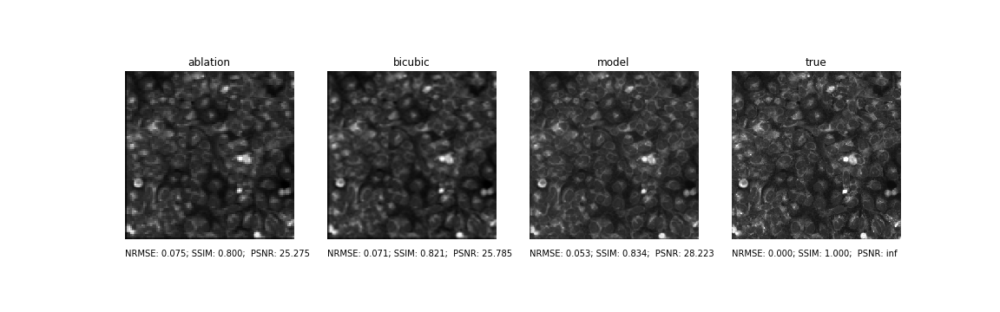
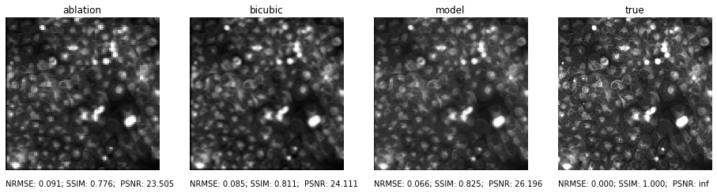

# Enhancement of the elemental imaging

Deep learning project for enhancing elemental images such as created by LA-ICP-MS or LIBS. 

## Training set preparation
All original images were crappyfied by simulation of laser ablation [[1]](https://pubs.acs.org/doi/10.1021/ac1014832)

*TODO: describe process of simulated laser ablation

## Model
*TODO: describe model architecture and loss and training

## Results

This part will contain different results from each trained model.

**Example images from cell dataset**

